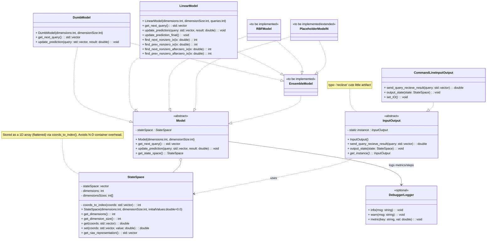

System Architecture (UML)

This diagram shows the core domain types and how they interact. It’s kept in sync with the current codebase. Update it whenever implementation, class names, or responsibilities change.

